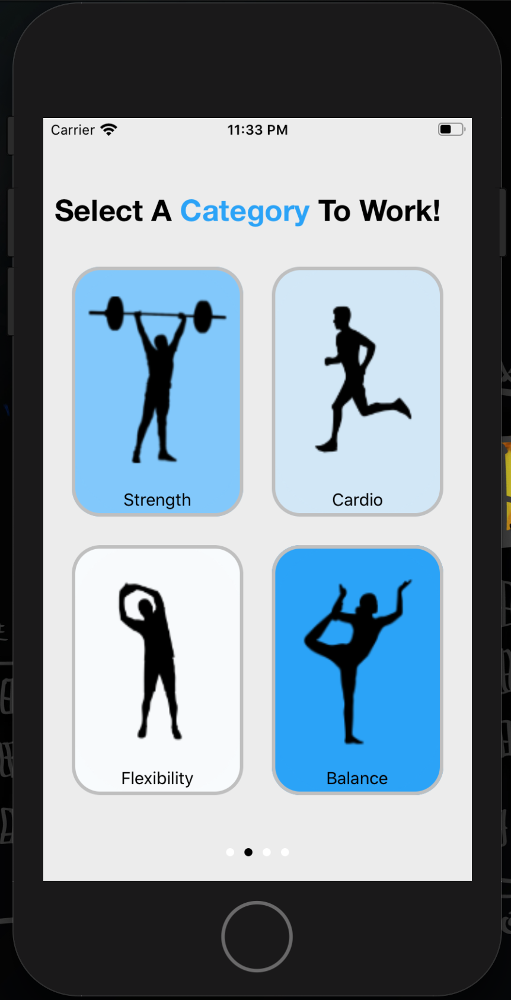
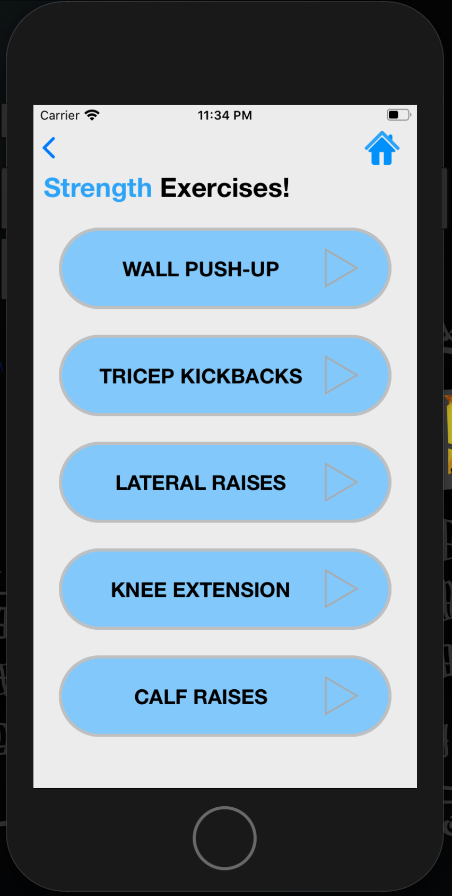
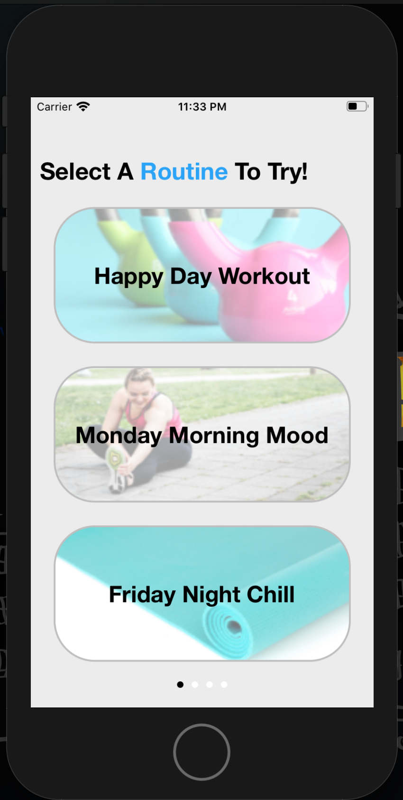
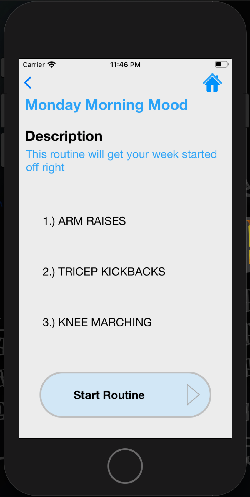
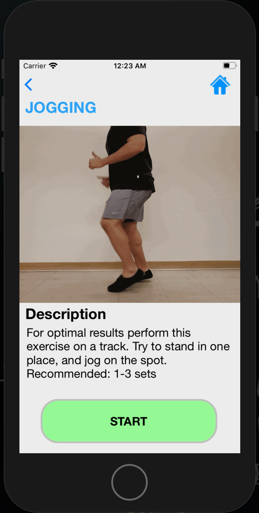
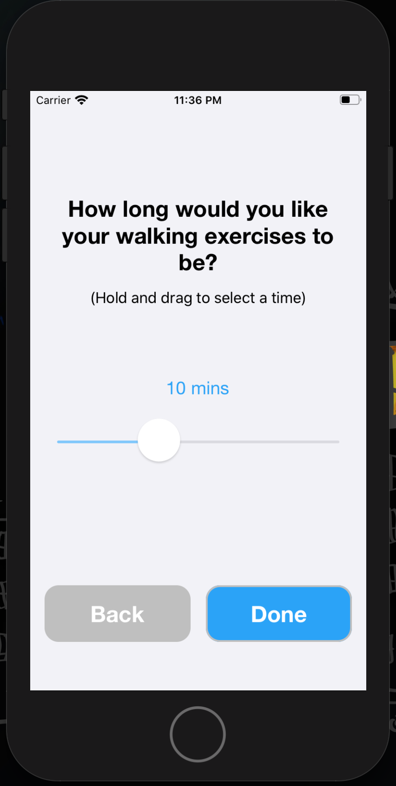
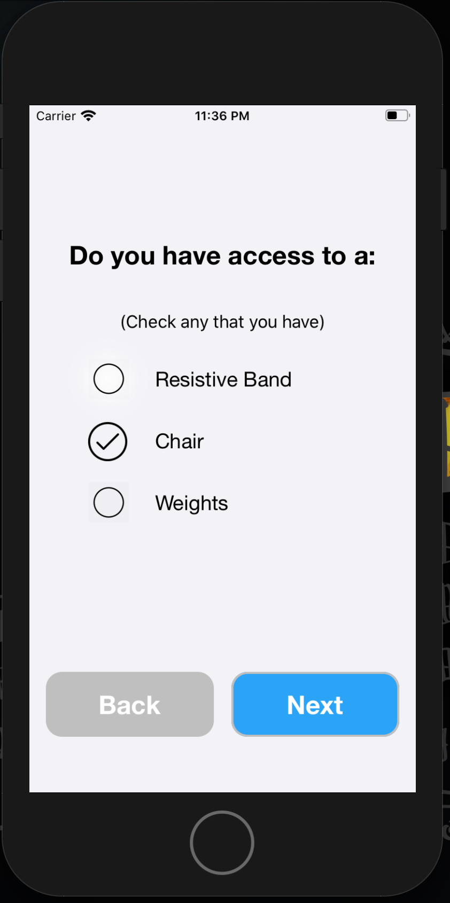
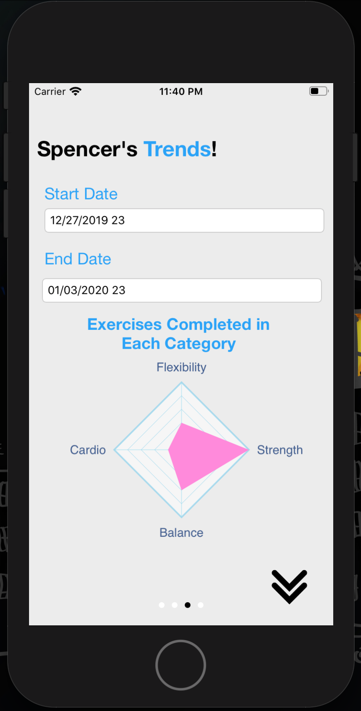
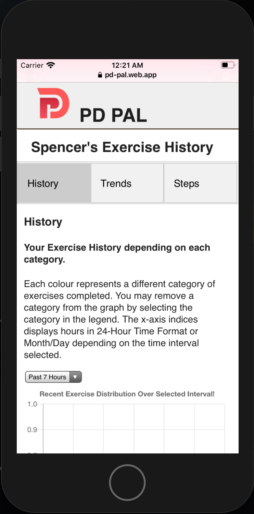

# PD PAL: An Exercise App Tailored For Parkinson's Patients

## In a Sentence
PD PAL is an iOS application that aims to address the mental and physical health issues commonly 
experienced by those diagnosed with Parkinson’s Disease. This is done by facilitating everyday at-home 
physical exercises to help manage the symptoms of PD. By staying active in a strategic way, users 
can expect to delay or reverse functional decline by improving their physical, psychological and 
social functioning, while easing motor and non-motor symptoms.

## Main Features
* 17 embedded exercise videos organized into 4 categories
* In-app data analysis for tracking user progress
* mobile pedometer feature to track number of steps
* Allows user-entered information to determine which exercises to choose from
* External website powered by Google’s Firebase (server-side, real-time database).

## Screenshots
### Try Individual Exercises

  
   

### Try Pre-made Routines

  
   

### Example Exercise: Jogging

  

### Customize Your Exercise Preferences

  
   

### View Your Trends In-App or on our Website

    
  

